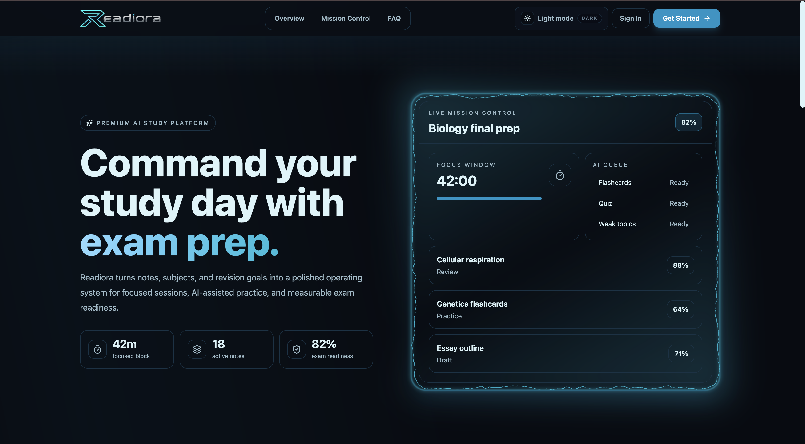
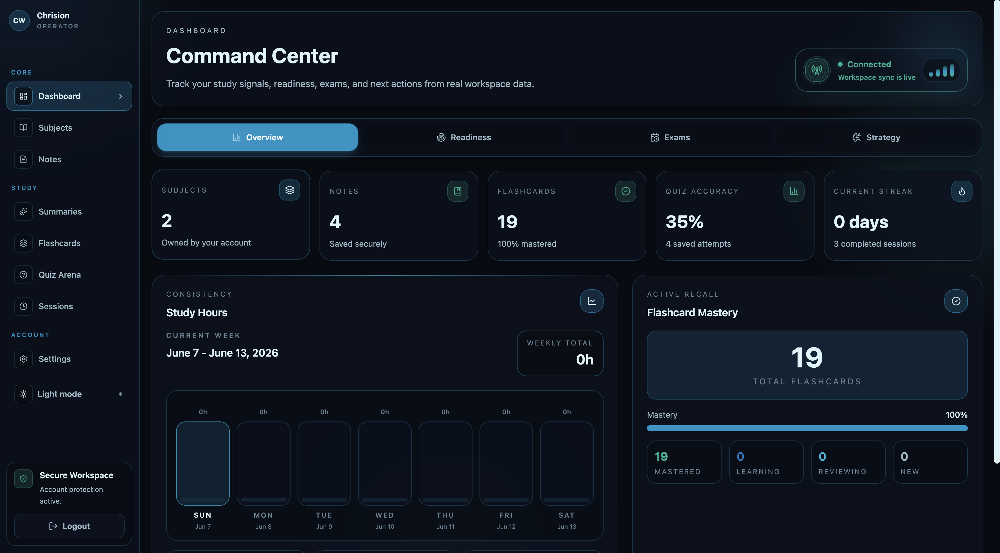
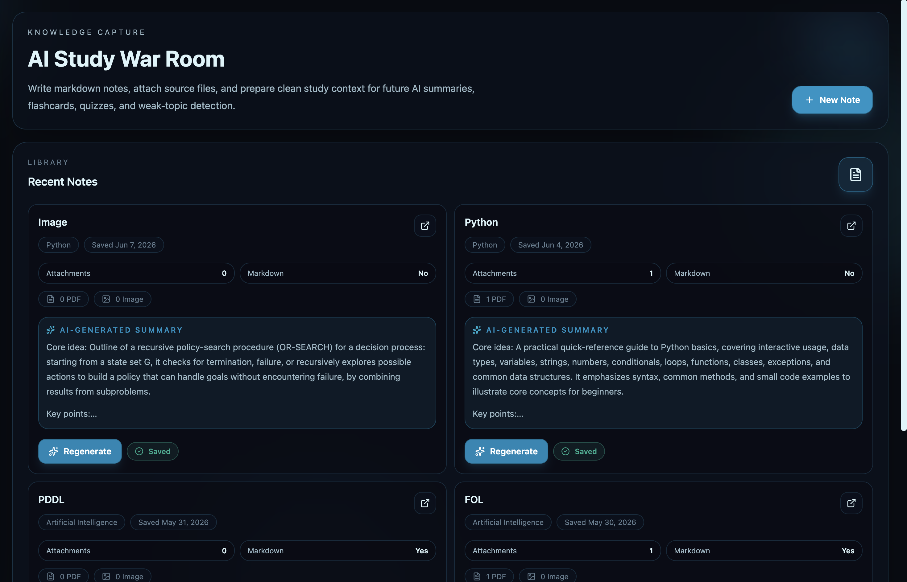
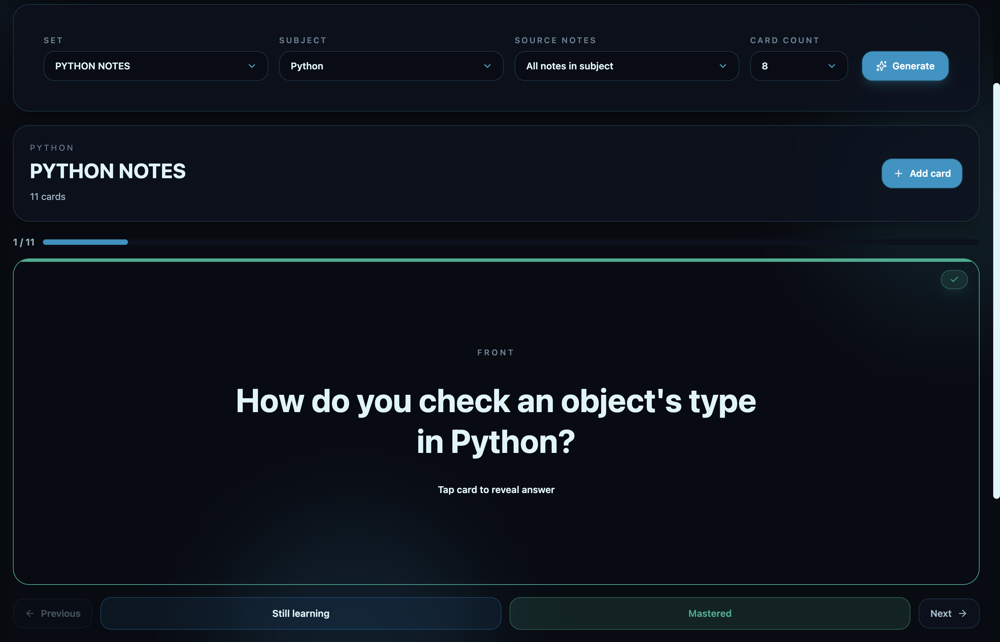
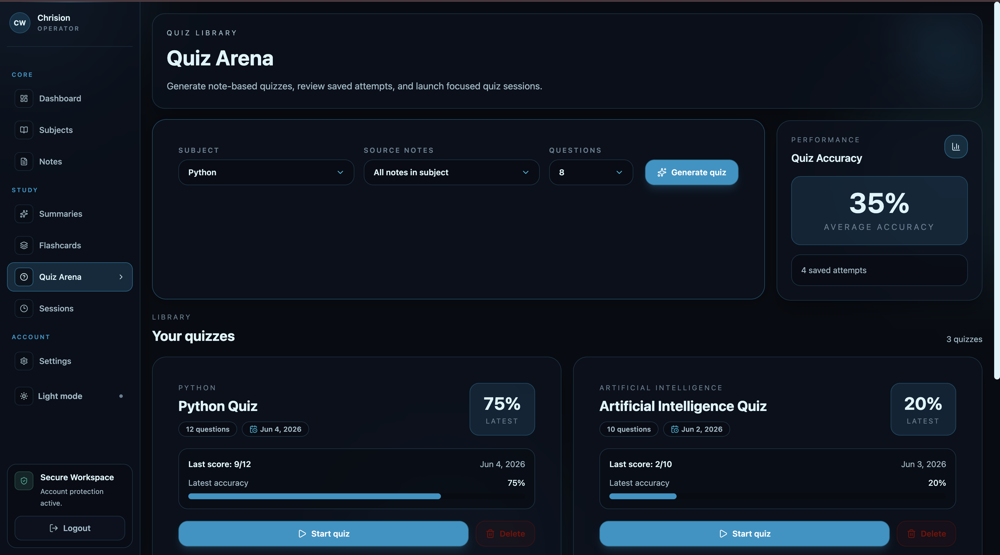
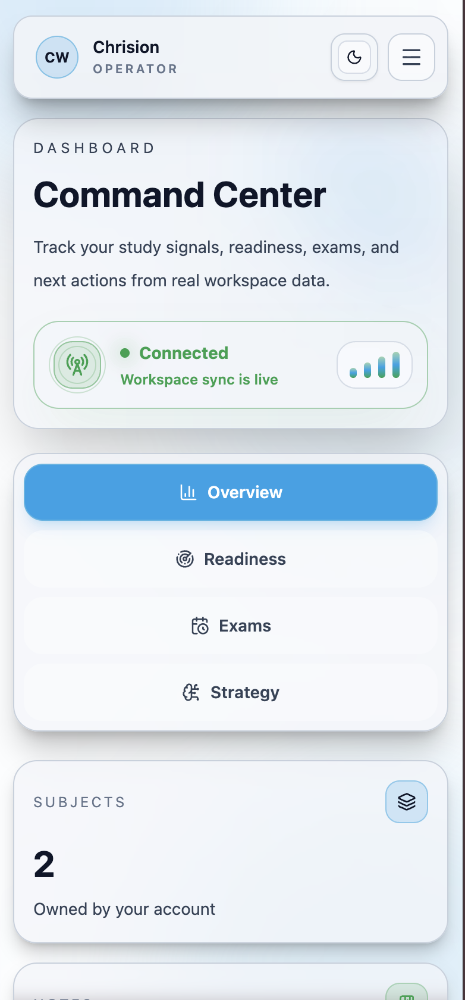

# Readiora

Readiora is a production-ready study workspace for building, organizing, and reviewing learning material in one place. It combines a React + Vite frontend with Supabase for authentication, data storage, file uploads, and Edge Functions. The app is designed around a focused dashboard experience for subjects, notes, summaries, flashcards, quizzes, study sessions, and account settings.

**Live production site:** `https://readiora.com`

## Product Summary

Readiora gives users a clean command-center interface for managing study work without forcing them to juggle separate tools. The app supports:

- Authentication with email/password, Google, and GitHub.
- Protected user-specific data for subjects, notes, summaries, flashcards, quizzes, sessions, and uploads.
- Supabase Storage for avatars and note attachments.
- AI-assisted workflows through Supabase Edge Functions.
- Responsive layouts for desktop, tablet, and mobile.
- Public marketing pages plus protected application routes.

## Core Features

- Landing page with product messaging and CTA flow.
- Signup, login, email verification, password recovery, and reset flows.
- Auth callback handling for OAuth and email verification.
- Dashboard with overview data and study shortcuts.
- Subjects management.
- Notes editor with markdown-style composition and attachment support.
- Summaries, flashcards, and quiz generation.
- Quiz taking and session tracking.
- Profile and settings management.
- Theme support with light/dark transitions.

## Tech Stack

| Area | Stack |
| --- | --- |
| Frontend | React 19 |
| Build Tool | Vite |
| Routing | React Router |
| Styling | Tailwind CSS 4, custom CSS |
| Backend | Supabase Auth, Postgres, Storage, Edge Functions |
| Animation | Framer Motion, Motion, GSAP |
| UI Utilities | Lucide React, class-variance-authority, clsx, tailwind-merge |
| Markdown / Math | React Markdown, KaTeX, remark-math, rehype-katex |
| State | React context, hooks, Zustand |

## Production Architecture

Readiora is a frontend-first application with Supabase providing the backend services.

- Browser app lives in `src/`.
- Supabase client is initialized in [`src/lib/supabase.js`](./src/lib/supabase.js).
- App routes are defined in [`src/App.jsx`](./src/App.jsx).
- Auth, profile, subject, notes, flashcard, quiz, session, and AI operations are isolated into service modules under `src/services/`.
- Supabase Edge Functions live in `supabase/functions/`.
- SQL setup and production hardening scripts live locally under `supabase/`.

### Main App Routes

| Route | Purpose |
| --- | --- |
| `/` | Landing page |
| `/login` | Login screen |
| `/signup` | Account creation |
| `/verify-email` | Email confirmation guidance |
| `/auth/callback` | OAuth / auth callback handler |
| `/forgot-password` | Password recovery request |
| `/reset-password` | Password reset flow |
| `/dashboard` | Main authenticated dashboard |
| `/subjects` | Subject management |
| `/notes` | Notes workspace |
| `/summaries` | Saved summaries |
| `/flashcards` | Flashcard view and study flow |
| `/quiz` | Quiz dashboard |
| `/quiz/:quizId/start` | Start a quiz session |
| `/sessions` | Study sessions |
| `/settings` | Account settings redirect |
| `/privacy` | Privacy policy |
| `/terms` | Terms of service |

## Repository Layout

```text
Readiora/
  src/
    assets/              Brand images and app assets
    components/          Shared UI, landing sections, and layout pieces
    context/             Theme and profile providers
    hooks/               Reusable React hooks
    lib/                 Supabase client setup
    pages/               Route-level screens
    routes/              Route guards
    services/            Supabase and app service modules
  public/                 Static assets and hosting files
  supabase/               Edge Functions, SQL, and local Supabase config
  README.md               Project overview and setup
```

## Local Development

### Requirements

- Node.js 18+ recommended
- npm
- A configured Supabase project

### Install

```bash
npm install
```

### Run locally

```bash
npm run dev
```

### Quality checks

```bash
npm run lint
npm run build
npm run preview
```

## Supabase Integration

Readiora uses Supabase for:

- Authentication
- User profiles
- Subjects
- Notes
- Flashcards
- Quizzes
- Study sessions
- Storage uploads
- AI workflow Edge Functions

The app’s Edge Functions currently include:

- `summarize-note`
- `generate-flashcards`
- `generate-quiz`
- `extract-attachment-text`

## Deployment Notes

Production is served from Cloudflare Pages and connected to the custom domain `readiora.com`.

- Canonical domain: `readiora.com`
- `www.readiora.com` redirects to the canonical domain
- SPA routing is configured so refreshes on protected routes do not 404
- Supabase Auth callback and recovery URLs must point to the production domain
- DNS is managed through Cloudflare

## Security Notes

- The browser only receives `VITE_SUPABASE_URL` and `VITE_SUPABASE_ANON_KEY`.
- Private secrets stay server-side.
- Row Level Security protects user-owned data.
- Production storage buckets are split by use case and access level.
- Deployment notes, SQL exports, and internal setup files are kept out of version control.

## Visual References

Add screenshots or diagrams here if you want a richer README for clients, reviewers, or future maintenance work.

### Landing Page



### Dashboard



### Notes Workspace



### Flashcards and Quiz




### Mobile Layout



## Maintenance

- Update OAuth redirect URLs whenever the canonical domain changes.
- Re-run `npm run lint` and `npm run build` before each deployment.
- Keep SQL migrations, deployment notes, and other operational artifacts local unless you explicitly want them versioned.

## Project Status

Readiora is in production and actively evolving. The current codebase is stable for the core study workflow, authentication, file uploads, and AI-assisted content generation, with additional polish and product work continuing over time.
